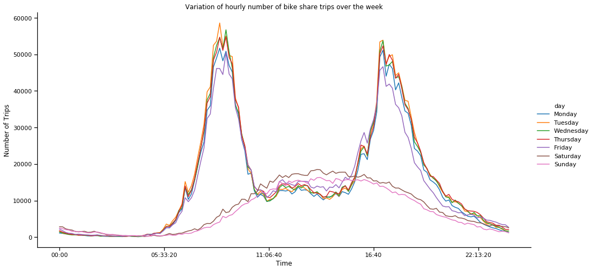

# San Francisco bike share dataset

This repository contains analysis of the Ford Go Bike bike share system data for SF specifically. Currently I've created some visualisations of the trips in this data set, investigating the trends and seasonality present in the number of trips made over time, as well as interesting geographical patterns.

